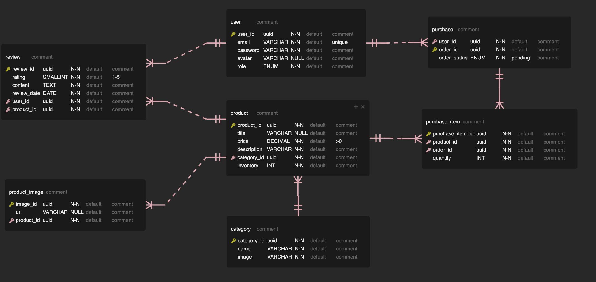
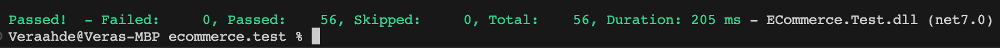

## Ecommerce Fullstack 

### Table of Contents
- [Introduction](#Introduction)
- [Technology Stack](#Technology-Stack)
- [Project Overview](#Project-Overview)
- [Architecture](#Architecture)
- [Features](#Features)
- [File Structure](#File-Structure)
- [Backend Implementation](#Backend-Implementation)
- [Frontend Connection](#Frontend-Connection)
- [Testing](#Testing)
- [Deployment](#Deployment)
- [Conclusion](#Conclusion)

### Introduction
This documentation offers an extensive overview of the Fullstack Project, detailing both frontend and backend implementations and functionalities. The project ensures a smooth user experience with powerful administrative tools for an Ecommerce web application. It consists of a TypeScript, React, and Redux Toolkit-based frontend, paired with a .NET Core 7, Entity Framework Core, and PostgreSQL-powered backend. The primary goal is to create a user-friendly application with features like user management, product browsing, cart functionality, and seamless checkout, alongside robust tools for administrators to manage users, products, and orders effectively.

### Technology Stack
#### Frontend:
- TypeScript
- SASS
- React
- Redux Toolkit
#### Backend:
- .NET Core 7
- Entity Framework Core
- PostgreSQL

### Architecture
The project follows the CLEAN architecture pattern in the backend to ensure separation of concerns and maintainability. The architecture consists of distinct layers:

- Presentation Layer: Includes the API controllers.
- Application Layer: Contains use cases and business logic.
- Domain Layer: Defines the domain models and entities.
- Infrastructure Layer: Manages data access and external services.

### File Structure
The file structure adheres to a modular and organized approach, separating concerns based on functionality and domain.
.
└── README.md
└── .gitignore
└── Ecommerce.Business
└── Ecommerce.Controller
└── Ecommerce.Core
└── Ecommerce.ERD
└── Ecommerce.Test
└── Ecommerce.WebAPI
└── Ecommerce.HTTPTest

### Features 
#### User Functionalities
**User Management**: Allows user registration and login.
**Product Browsing**: Enables users to view, search, and sort products.
**Shopping Cart**: Facilitates adding and managing products in the cart.
**Checkout**: Allows users to place orders.

#### Admin Functionalities
**User Management**: Admins can view and delete users.
**Product Management**: Admins can view, edit, delete, and add products.
**Order Management**: Admins can view all orders.

### Backend Implementation
#### Database Schema 
Before coding, a well-planned database schema was designed to ensure proper data organization and relationships.

### Error Handling
The Fullstack Project employs .NET Core's built-in exception handling capabilities to manage exceptions gracefully throughout the application. While not implementing a separate custom error handling middleware, our backend leverages the inherent exception capture system provided by the .NET Core framework.

### Swagger API endpoints 
API endpoints are annotated for Swagger documentation, providing an interactive UI for testing and documentation.https://shopify-2023.azurewebsites.net/swagger/index.html

### Frontend Connection
The modified frontend project is connected to this backend server to create a cohesive fullstack application. Refer to the frontend repository here for frontend-related details.

### Testing
Unit tests are implemented, primarily focusing on the Service layer using xUnit. Additional tests cover entities, repositories, and controllers.
Swagger Documentation. Both frontend and backend code undergo unit testing to achieve high test coverage and ensure all major functionalities are covered.

### Deployment
https://659527c2b075937d2e82f9c9--transcendent-cupcake-bdde5e.netlify.app test data :

login as admin: Email: test@mail.com Password: test1234567890

login as Customer to place orders Email:lucychang@mail.com Password:lucy999

The live servers host frontend, backend, and database servers for comprehensive access and functionality.

###  Conclusion
The Fullstack Project is a robust, user-friendly application that offers seamless user experiences and efficient administrative capabilities. It demonstrates the integration of React, Redux Toolkit in the frontend and .NET Core 7, Entity Framework Core, PostgreSQL in the backend to deliver a complete fullstack solution.
